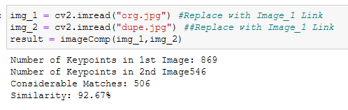
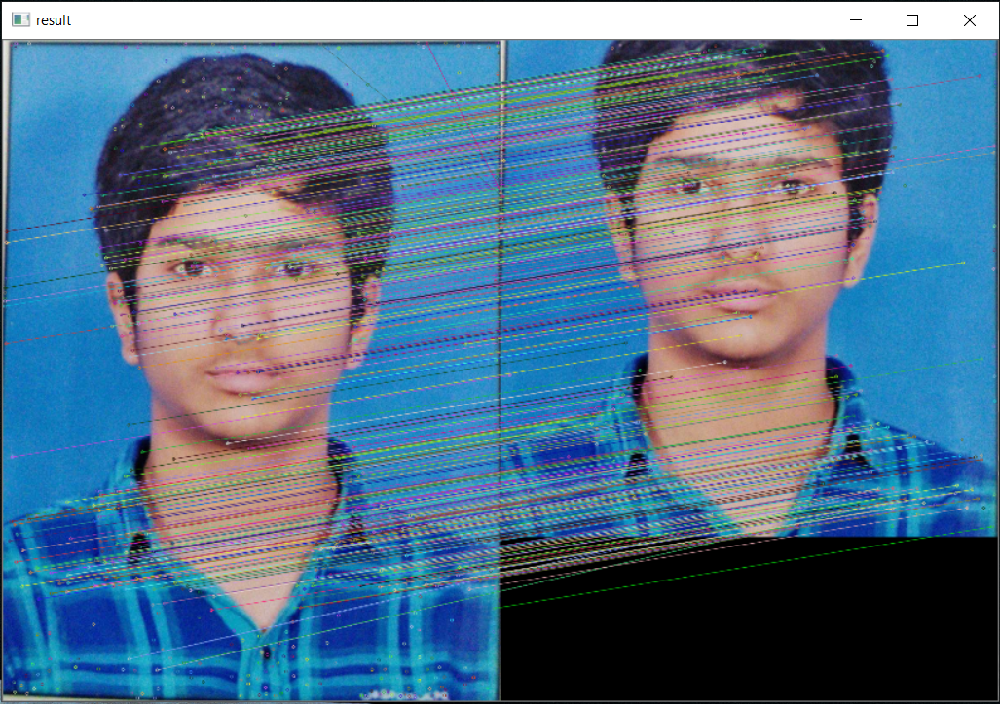

<h1>Image Comparator</h1>
<h4>When the two images are uploaded, it compares the images are and displays the similarity in Percentage<h4> 

<h3>Image 1</h3>

<h3>Image 2</h3>

<h3>Output</h3>

<h3>Keypoint Matches</h3>

